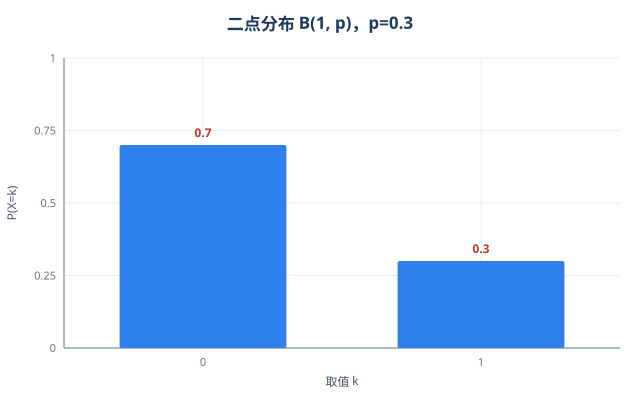
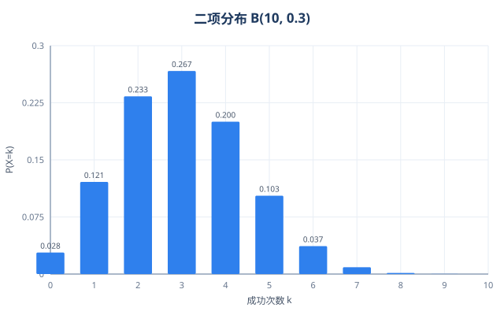
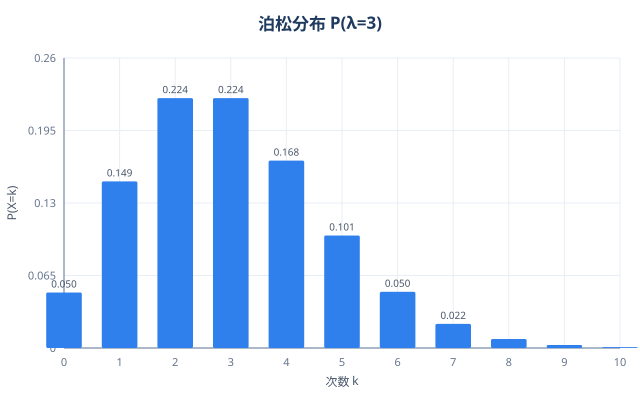
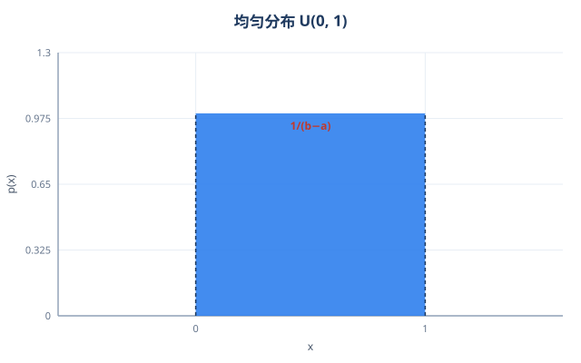
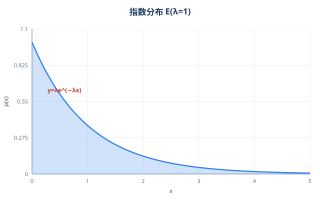
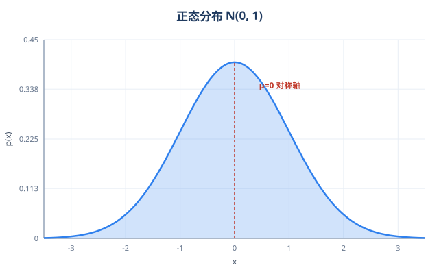

# 1.7 概率与数理统计

> 来源：《注册电气工程师执业资格考试公共基础考试复习教程》（天津大学编委会）第 1 章「数学」第 1.7 节
> 位置：教材正文 129–157 页；本文件按小节提取该节全部复习内容与例题索引
> 配套：`概率论与数理统计_复习笔记.html`（同目录，每个知识点配最简例题与通俗讲解，可与本文档配合使用）

---

## 考试大纲要求

1. 了解随机事件与样本空间的概念，理解随机事件的概念，掌握事件的关系与运算。
2. 理解概率的概念，了解条件概率与事件独立性的概念，掌握概率的基本性质，会应用概率的加法公式、乘法公式、全概率公式与贝叶斯公式解决简单的应用问题。
3. 了解古典概型，会计算简单的古典型概率，会应用超几何概率公式与二项概率公式解决简单的应用问题。
4. 理解一维随机变量的概念，了解分布函数的概念与性质，了解离散型随机变量的概率分布与连续型随机变量的概率密度函数的概念，掌握应用分布函数、概率分布、概率密度函数计算与随机变量相联系的事件的概率。
5. 理解随机变量数学期望与方差的概念，掌握随机变量函数数学期望的性质与计算方法，了解标准差的概念。
6. 掌握二点分布、二项分布、泊松分布、均匀分布、指数分布、正态分布及它们的数学期望与方差。
7. 了解矩、协方差与相关系数的概念，了解它们的性质与计算方法。
8. 了解总体、样本与统计量的概念，理解样本均值与样本方差的概念，了解样本均值与样本方差的简单性质，知道 χ² 分布、t 分布与 F 分布。
9. 理解点估计的概念，会求简单的矩估计与最大似然估计，了解估计量的评选标准。
10. 了解区间估计的概念，会求正态总体中未知参数的置信区间。
11. 了解假设检验的概念，会对正态总体均值与方差作显著性检验。

---

## 1.7.1 随机事件与概率

**基本概念**

- 随机事件：在一定条件下可能发生也可能不发生的事件（简称事件），记事件 A 的概率为 P(A)，规定 **0 ≤ P(A) ≤ 1**。
- 必然事件 Ω 与不可能事件 Φ 是两个特殊随机事件：**P(Ω)=1，P(Φ)=0**。
- 随机事件用样本空间 Ω 的子集（集合）表达，事件运算本质上是集合运算。

**1. 随机事件之间的运算**

| 名称 | 含义 | 记号 |
|---|---|---|
| 对立事件（逆事件） | 事件 A 不发生 | Ā |
| 和事件 | A 与 B 至少有一个发生 | A+B（或 A∪B） |
| 积事件 | A 与 B 同时发生 | AB（或 A∩B） |
| 差事件 | A 发生且 B 不发生 | A−B（或 AĀ，A−AB） |

**2. 随机事件之间的关系**

- 包含：B⊃A（A⊂B），表示"当 A 发生时 B 必定发生"。
- 相等：A⊂B 且 B⊂A，记 A=B。
- 互不相容（互斥）：AB=Φ，A 与 B 不可能同时发生。
- 对立（互逆）：A 与 B 有且只有一个发生，Ā=B（或 B=Ā）。
- 完备事件组：A₁,…,Aₙ 两两互不相容且 A₁+…+Aₙ=Ω。n=2 时，A 与 Ā 构成完备事件组。
- 相互独立：**P(AB)=P(A)P(B)**（直观意义：A 与 B 是否发生相互不影响）。

**3. 运算性质（德摩根法则）**

集合运算的交换律、结合律、分配律均适用，特别地：

- **A+B = Ā·B̄**（和的逆等于逆的积）
- **AB = Ā+B̄**（积的逆等于逆的和）

**4. 条件概率**

- P(B|A) = P(AB)/P(A)，其中 P(A)>0。
- 当 A 与 B 相互独立时，P(B|A)=P(B)，P(A|B)=P(A)。

**5. 概率的计算公式**

| 公式 | 表达式 |
|---|---|
| 逆公式 | P(Ā) = 1 − P(A) |
| 加法公式 | P(A+B) = P(A)+P(B)−P(AB)；A、B 互不相容时 P(A+B)=P(A)+P(B) |
| 乘法公式 | P(AB) = P(A)P(B|A) = P(B)P(A|B)；A、B 独立时 P(AB)=P(A)P(B) |
| 求差公式 | P(A−B) = P(A)−P(AB)；A⊃B 时 P(A)≥P(B)，P(A−B)=P(A)−P(B) |
| 全概率公式 | P(B) = Σᵢ P(Aᵢ)P(B|Aᵢ)，A₁,…,Aₙ 为完备事件组且 P(Aᵢ)>0 |
| 贝叶斯公式 | P(Aᵢ|B) = P(Aᵢ)P(B|Aᵢ) / Σⱼ P(Aⱼ)P(B|Aⱼ)，i=1,…,n |

**例题索引**：例 1.7-1（德摩根法则应用）、例 1.7-2（P(A)=0 与独立性）、例 1.7-3（三种情形下求 P(A+B)、P(A−B)）、例 1.7-4（全概率+贝叶斯公式）、例 1.7-5（乘法公式）

**记忆要点**：概率是"可能性大小"的度量（必然=1，不可能=0）；事件运算就是集合运算（韦恩图：或=并、且=交、差=有我无你、横杠=圈外）；**互斥 ≠ 独立**——互斥时知道 A 发生就能排除 B 发生，恰恰说明"影响很大"；**全概率=分情况汇总（原因→结果）**，**贝叶斯=反推（结果→原因）**；加法公式别忘减 P(AB)（重叠部分被加了两次）。

---

## 1.7.2 古典概型

**1. 古典型概率**

若随机试验只有有限个（n 个）等可能结果，事件 A 包含 m 个结果，则

- **P(A) = m/n**

计算古典概率的关键是"计数"，常用工具是排列组合知识。

**2. 超几何概率公式**

N 件产品中有 M 件次品，任取 n 件，恰有 k 件次品的概率：

- **P(A) = C(M,k)·C(N−M, n−k) / C(N,n)**

（适用：不放回摸球问题）

**3. 二项概率公式（伯努利试验）**

每次试验只有"成功/失败"两种结果，成功概率为 p（0<p<1），重复独立做 n 次试验，恰出现 k 次成功的概率：

- **P(A) = C(n,k)·pᵏ·(1−p)ⁿ⁻ᵏ**

（适用：放回摸球问题）

**例题索引**：例 1.7-6（红白球，超几何公式/古典概型）、例 1.7-7（不放回/放回取晶体管）、例 1.7-8（抽签抓阄模型，与次序无关）、例 1.7-9（遇红灯，二项概率）、例 1.7-10（整除问题，古典概型+加法公式）

**记忆要点**：古典概型两个条件——结果有限 + 等可能，满足就能"数着算"（P=m/n）；**不放回→超几何**（组合数直接套），**放回/独立重复→二项**；抽签（抓阄）问题抽到的概率与次序无关。

---

## 1.7.3 一维随机变量的分布和数字特征

**1. 随机事件及其概率的表达**

引进随机变量 X 后，随机事件用 {X∈I} 表达（数集 I⊂(−∞,+∞)），如 {a<X≤b}。两个随机变量 X 与 Y 相互独立 ⟺ 对任意集合 I₁,I₂，事件 {X∈I₁} 与 {Y∈I₂} 相互独立。

**2. 随机变量分布的三种形式**

| 形式 | 适用 | 概率计算 |
|---|---|---|
| 概率分布 | 离散型 | P(X∈I) = Σ pₖ（k: xₖ∈I） |
| 概率密度函数 | 连续型 | P(X∈I) = ∫ᵢ p(x)dx |
| 分布函数 | 一切随机变量 | F(x) = P(X≤x) |

- 离散型概率分布表：{X=xₖ} 构成完备事件组，pₖ>0 且 Σpₖ=1。
- 连续型概率密度函数满足：① p(x)≥0；② ∫₋∞⁺∞ p(x)dx=1。且 **P(X=x₀)=0**（但 {X=x₀}≠Φ），从而 P(a<X≤b)=P(a≤X<b)=P(a<X<b)=P(a≤X≤b)=∫ₐᵇ p(x)dx。
- 分布函数 F(x)=P(X≤x) 的四条特征性质：①有界性 0≤F(x)≤1；②单调性；③右连续性；④lim(x→−∞)F(x)=0，lim(x→+∞)F(x)=1。满足这四条性质的实值函数必为某随机变量的分布函数。
- 由分布函数计算概率：P(a<X≤b)=F(b)−F(a)；P(X=x₀)=F(x₀)−lim(x→x₀⁻)F(x)。
- 离散型：F(x)=Σ pₖ（xₖ≤x），阶梯函数，在 xₖ 处跳跃 pₖ。
- 连续型：F(x)=∫₋∞ˣ p(t)dt，F(x) 连续且在 p(x) 连续点处 **F′(x)=p(x)**（即 F 是 p 的一个原函数）。

**3. 常用随机变量的分布**

离散型（三类）：

- 二点分布（伯努利分布）：X∈{0,1}，p=P(X=1)。表示一次伯努利试验成功的次数。
- 二项分布：P(X=k)=C(n,k)pᵏ(1−p)ⁿ⁻ᵏ，k=0,1,…,n。表示 n 次独立伯努利试验成功次数。
- 泊松分布：P(X=k)=e⁻λ·λᵏ/k!，k=0,1,2,…，λ>0。

连续型（三类）：

- 均匀分布：p(x)=1/(b−a)（a<x<b），其余为 0；F(x)=0(x<a)，(x−a)/(b−a)(a≤x<b)，1(x≥b)。
- 指数分布：p(x)=λe⁻λˣ（x>0），其余为 0；F(x)=1−e⁻λˣ（x≥0），0（x<0）。
- 正态分布 N(μ,σ²)：p(x) = 1/(√(2π)σ)·e^[−(x−μ)²/(2σ²)]，−∞<x<+∞。N(0,1) 为标准正态分布，分布函数记为 Φ(x)，可查表；Φ(0)=1/2，Φ(−x)=1−Φ(x)。

**六大常用分布图像**（参数示例：二点 p=0.3、二项 n=10 p=0.3、泊松 λ=3、均匀 U(0,1)、指数 λ=1、正态 N(0,1)；图为理论概率/密度曲线）

**离散型：**① 二点分布 B(1,p)　② 二项分布 B(n,p)　③ 泊松分布 P(λ)

**连续型：**④ 均匀分布 U(a,b)　⑤ 指数分布 E(λ)　⑥ 正态分布 N(μ,σ²)

**4. 数字特征**

数学期望：

- 离散型：E(X)=Σ xₖpₖ；随机变量函数：E(Y)=E[f(X)]=Σ f(xₖ)pₖ。
- 连续型：E(X)=∫₋∞⁺∞ x·p(x)dx；E(Y)=∫₋∞⁺∞ f(x)·p(x)dx。
- 性质：①E(c)=c；②E(kX)=kE(X)；③E(X+c)=E(X)+c；④E(kX+lY+c)=kE(X)+lE(Y)+c；⑤X、Y 独立时 E(XY)=E(X)E(Y)。

方差与标准差：

- **D(X)=E[X−E(X)]²**；常用计算公式：**D(X)=E(X²)−[E(X)]²**；标准差 = √D(X)。
- 性质：①D(c)=0；②D(kX)=k²D(X)；③D(X+c)=D(X)；④X、Y 独立时 D(kX+lY+c)=k²D(X)+l²D(Y)。
- 注意 D(−X)=(−1)²D(X)=D(X) 而非 −D(X)；D(X)≥0，D(X)=0 ⟺ X 为常数（P(X=c)=1）。

中心化与标准化：

- 中心化：X\*=X−E(X)，E(X\*)=0，D(X\*)=D(X)。
- 标准化：X\*\*=(X−E(X))/√D(X)，E(X\*\*)=0，D(X\*\*)=1。
- 若连续型随机变量的密度关于 x=μ 对称，则 E(X)=μ。

**5. 常用随机变量的数字特征（可直接使用）**

| 分布 | 数学期望 E(X) | 方差 D(X) |
|---|---|---|
| 二点分布（参数 p） | p | p(1−p) |
| 二项分布（n, p） | np | np(1−p) |
| 泊松分布（λ） | λ | λ |
| 均匀分布（a, b） | (a+b)/2 | (b−a)²/12 |
| 指数分布（λ） | 1/λ | 1/λ² |
| 正态分布 N(μ, σ²) | μ | σ²（标准差 σ） |

**正态分布两个重要定理**

- 定理 1：X~N(μ,σ²) ⟹ Y=kX+c~N(kμ+c, k²σ²)；特殊地 (X−μ)/σ~N(0,1)（标准化变换）。
- 定理 2：X、Y 独立，X~N(μ₁,σ₁²)，Y~N(μ₂,σ₂²) ⟹ Z=kX+lY+c~N(kμ₁+lμ₂+c, k²σ₁²+l²σ₂²)。

**例题索引**：例 1.7-11~1.7-12（事件用随机变量表达，max/min）、例 1.7-13~1.7-14（由概率分布/分布函数求 F(x)、概率）、例 1.7-15~1.7-16（连续型：求常数、概率、分布函数、密度）、例 1.7-17~1.7-19（正态分布概率与线性变换）、例 1.7-20（掷骰子，二项分布）、例 1.7-21~1.7-22（期望、方差、标准差、随机变量函数期望）、例 1.7-23~1.7-25（常用分布数字特征+性质求 E、D）、例 1.7-26（对称性判断期望）

**记忆要点**：所有概率加起来必须等于 1——"概率守恒"，这是求未知参数（常数 c、概率 pₖ）的第一招；分布函数像"从 0 爬到 1 的楼梯"，F(x) 就是"到 x 为止累计的概率"，区间概率=两台阶差 F(b)−F(a)；连续型单点概率为 0（但事件≠不可能事件）；**泊松的标志 E=D=λ**；**指数分布有"无记忆性"**（等待时间：已等多久不影响还要等多久）；正态像口钟，对称轴是 μ（左右各 0.5）；**标准化=换统一尺子**（(X−μ)/σ~N(0,1) 查 Φ 表），正态线性函数仍正态；期望是线性运算，方差乘常数要**平方**（D(kX)=k²D(X)）。

---

## 1.7.4 矩、协方差与相关系数

**1. 矩**

- k 阶原点矩：E(Xᵏ)；k 阶中心矩：E(X−EX)ᵏ（k 为正整数）。
- 数学期望 E(X) 是一阶原点矩；方差 D(X) 是二阶中心矩。矩在点估计中有重要应用。

**2. 两个随机变量函数的数学期望**

- 离散型（联合分布 pᵢⱼ）：E(Z)=ΣᵢΣⱼ f(xᵢ,yⱼ)·pᵢⱼ。
- 连续型（联合密度 p(x,y)）：E(Z)=∫∫ f(x,y)·p(x,y)dxdy。

**3. 协方差**

- 定义：**Cov(X,Y)=E[(X−EX)(Y−EY)]**；常用公式：**Cov(X,Y)=E(XY)−E(X)E(Y)**。
- 性质：①Cov(X,X)=D(X)，Cov(X,Y)=Cov(Y,X)；②Cov(X,c)=0；③Cov(kX,lY)=kl·Cov(X,Y)；④Cov(X₁±X₂,Y)=Cov(X₁,Y)±Cov(X₂,Y)；⑤X、Y 独立时 Cov(X,Y)=0。

**4. 相关系数**

- 定义：**ρ(X,Y)=Cov(X,Y)/√(D(X)D(Y))**；ρ=0 时称 X 与 Y 不相关。
- 性质：①|ρ(X,Y)|≤1；②X、Y 独立 ⟹ 不相关，但反之一般不成立；③D(X±Y)=D(X)+D(Y)±2ρ√(D(X)D(Y))=D(X)+D(Y)±2Cov(X,Y)。

**例题索引**：例 1.7-27~1.7-28（求 E(XY)、Cov、ρ）、例 1.7-29（协方差性质）、例 1.7-30（D(3X−2Y)）

**记忆要点**：协方差 Cov(X,Y)=E(XY)−E(X)E(Y)，衡量"X 与 Y 是否一起动"（正=同涨同跌，负=此消彼长，0=各干各的）；相关系数把协方差**归一化到 [−1,1]**，|ρ| 越接近 1 线性关系越强；**独立 ⟹ 不相关，但不相关一般推不出独立**（可能只是没有线性关系）。

---

## 1.7.5 数理统计的基本概念

**1. 总体与样本**

- 总体：全体研究对象的某个特征值（用随机变量 X 表示，X 服从正态分布时称正态总体）；样本：总体中部分个体的该特征值。
- "X₁,…,Xₙ 是取自总体 X 的容量为 n 的样本" ⟺ X₁,…,Xₙ 相互独立且每个 Xᵢ 与 X 同分布；从而 E(Xᵢ)=E(X)，D(Xᵢ)=D(X)。
- 样本双重意义：抽样前是 n 个随机变量；抽样后是 n 个数据（样本值）。

**2. 统计量**（样本函数，不能含总体未知量）

- 样本均值：X̄ = (1/n)ΣXᵢ
- 样本方差：S² = 1/(n−1)·Σ(Xᵢ−X̄)²；样本标准差 S=√S²
- 样本 k 阶原点矩：(1/n)ΣXᵢᵏ；样本 k 阶中心矩：(1/n)Σ(Xᵢ−X̄)ᵏ
- 注意：样本均值是一阶原点矩，但样本方差不是样本二阶中心矩。

**定理 3**：E(X̄)=μ，D(X̄)=σ²/n，E(S²)=σ²。注意 E(X̄²)≠μ²，E(S)≠σ。

**3. 三个常用分布**（参数均称为自由度）

- χ² 分布：X₁,…,Xₙ 独立同 N(0,1) ⟹ χ²=ΣXᵢ² ~ χ²(n)。
- t 分布：X~N(0,1)、Y~χ²(n) 独立 ⟹ T=X/√(Y/n) ~ t(n)。
- F 分布：X~χ²(n₁)、Y~χ²(n₂) 独立 ⟹ F=(X/n₁)/(Y/n₂) ~ F(n₁,n₂)。
- 临界值均通过查表得到。

**定理 4**（正态总体抽样分布）：X₁,…,Xₙ 取自 N(μ,σ²)，
① X̄~N(μ,σ²/n)，即 √n(X̄−μ)/σ~N(0,1)；
② (n−1)S²/σ² = (1/σ²)Σ(Xᵢ−X̄)² ~ χ²(n−1)；
③ √n(X̄−μ)/S ~ t(n−1)。

**定理 5**：两个独立正态总体样本方差比 (S₁²/σ₁²)/(S₂²/σ₂²) ~ F(n₁−1, n₂−1)。

**定理 6**：定理 5 中若 σ₁²=σ₂²，则 [(X̄−Ȳ)−(μ₁−μ₂)] / [S_w·√(1/n₁+1/n₂)] ~ t(n₁+n₂−2)，其中 S_w² = [(n₁−1)S₁²+(n₂−1)S₂²]/(n₁+n₂−2)。

**例题索引**：例 1.7-31（均匀总体求 E(X̄)、D(X̄)、E(S²)）、例 1.7-32（统计量服从 t(15)）、例 1.7-33（X~N(0,1) ⟹ X²~χ²(1)）

**记忆要点**：**样本方差分母是 n−1 不是 n**（X̄ 用掉一个自由度），这是最常踩的坑；S² 是 σ² 的无偏估计，但 S 不是 σ 的无偏估计；三大分布只考"识别"——**N 除以 √(χ²/n) 是 t，两个 χ² 之比是 F**；样本均值比单个数据更集中：D(X̄)=σ²/n，样本越多均值越准。

---

## 1.7.6 参数估计——点估计

- 参数估计：根据样本 X₁,…,Xₙ 对总体 X 中未知参数 θ 估计。点估计用某个实数估计 θ，记作 θ̂（抽样前为估计量 θ̂=f(X₁,…,Xₙ)，抽样后代数据得估计值）。

**1. 矩估计**

原理：用样本原点矩估计相应（同阶）总体原点矩。
E(X) 的矩估计 = X̄；D(X) 的矩估计 = (1/n)Σ(Xᵢ−X̄)²（**不是 S²**）；√D(X) 的矩估计 = √[(1/n)Σ(Xᵢ−X̄)²]（不是 S）。

**2. 最大似然估计**

- 似然函数：L(θ)=∏ p(xᵢ;θ)（p(x;θ) 为总体分布，连续型为密度、离散型为概率分布）。
- 若 θ̂ 满足 L(θ̂)=max L(θ)，则 θ̂ 为 θ 的最大似然估计。
- 求解步骤：①计算 L(θ)；②计算 ln L(θ)；③求 ∂/∂θ ln L(θ)；④解似然方程 ∂/∂θ ln L(θ)=0（唯一解即最大似然估计，无需验证充分条件）。

**3. 估计量的评选标准**

- 无偏估计：E(θ̂)=θ。
- 有效：θ̂\* 与 θ̂ 均为无偏估计且 D(θ̂\*)<D(θ̂)，称 θ̂\* 比 θ̂ 有效。

**例题索引**：例 1.7-34（p(x;θ)=θx^(θ−1)，求矩估计与最大似然估计）、例 1.7-35（泊松总体 λ 的最大似然估计=X̄）、例 1.7-36（无偏估计判断）、例 1.7-37（无偏估计中最有效者）

**记忆要点**：**矩估计="用样本矩代替总体矩，反解参数"**（如样本均值=总体均值）；**最大似然="哪个参数最可能产生眼前这组数据"**，步骤：写似然 L(θ)→取对数 lnL(θ)→求导=0→解似然方程（唯一解即估计）；注意 **D(X) 的矩估计是 (1/n)Σ(Xᵢ−X̄)² 而不是 S²**；"无偏"=估计量的平均值正好等于真值。

---

## 1.7.7 参数估计——区间估计

**1. 置信区间**

- 用区间估计未知参数 θ 记 [θ̄, θ̄]。若端点均为样本函数，且对给定 1−α（0<α<1）满足 **P(θ̄≤θ≤θ̄)=1−α**，则称随机区间 [θ̄,θ̄] 为置信度（置信水平）1−α 的置信区间。通常取 1−α=90%、95%、99%。
- 置信度反映可信程度（越大越好），区间长度反映精度（越短越好）。

**2. 单个正态总体 N(μ,σ²) 的置信区间**（置信度 1−α）

- 数学期望 μ：
  - σ²=σ₀² 已知：**[x̄−λσ₀/√n, x̄+λσ₀/√n]**，λ 满足 P(|U|≤λ)=1−α，U~N(0,1)。
  - σ² 未知：**[x̄−λs/√n, x̄+λs/√n]**，λ 满足 P(|T|≤λ)=1−α，T~t(n−1)。
- 方差 σ²（μ 未知）：**[ (1/λ₂)Σ(xᵢ−x̄)², (1/λ₁)Σ(xᵢ−x̄)² ]**；标准差 σ 取相应开方，其中 λ₁、λ₂ 满足 P(χ²<λ₁)=P(χ²>λ₂)=α/2，χ²~χ²(n−1)。

**3. 两个正态总体的置信区间**

- 均值差 μ₁−μ₂（σ₁²=σ₂² 未知）：端点 (x̄−ȳ)±λ·s\*·√(1/n₁+1/n₂)，λ 满足 P(|T|≤λ)=1−α，T~t(n₁+n₂−2)。
- 方差比 σ₁²/σ₂²（μ₁、μ₂ 未知）：[ (1/λ₂)(s₁²/s₂²), (1/λ₁)(s₁²/s₂²) ]，λ₁、λ₂ 满足 P(F<λ₁)=P(F>λ₂)=α/2，F~F(n₁−1,n₂−1)。

**例题索引**：例 1.7-38（5 次测量，求 μ 与 σ 的 0.95 置信区间：μ 为 [1244.2, 1273.8]，σ 为 [7.2, 34.3]）

**记忆要点**："对号入座"记牢：**σ² 已知用 U（查 N(0,1)）→ σ² 未知用 T（查 t(n−1)）→ 方差用 χ²（查 χ²(n−1)）→ 两方差比用 F**；置信区间=“有 1−α 的把握认为真值落在这个范围内”；置信度越高可信度越高（区间越长），区间越短精度越高。

---

## 1.7.8 假设检验

**基本概念**

- 假设检验：根据样本对预先所作的假设进行鉴定。理论基础是"概率性质的反证法"（小概率事件在一次观察中基本不会发生）。
- 检验结论：拒绝假设，或不能拒绝假设（假设相容）。
- 检验标准（显著性水平）α（0<α<1，常取 1%、5%、10%）：保证犯第一类错误（假设成立但检验拒绝假设）的概率不超过 α。

**1. 显著性检验的一般步骤**

①建立假设 H₀；②针对 H₀ 构造检验统计量；③在检验标准 α 下对检验统计量建立不等式；④把数据代入不等式：成立则拒绝 H₀，不成立则 H₀ 相容。

**2. 单个正态总体的假设检验**（X~N(μ,σ²)，检验标准 α）

- 数学期望（H₀: μ=μ₀）：
  - σ²=σ₀² 已知：检验统计量 **U=√n(X̄−μ₀)/σ₀**，H₀ 成立时 U~N(0,1)；|u|>λ 时拒绝 H₀（λ 满足 P(|U|>λ)=α）。
  - σ² 未知：检验统计量 **T=√n(X̄−μ₀)/S**，H₀ 成立时 T~t(n−1)；|t|>λ 时拒绝 H₀（λ 满足 P(|T|>λ)=α）。
- 方差（μ 未知，H₀: σ²=σ₀²，等价于检验 H₀: σ=σ₀）：检验统计量 **χ²=(n−1)S²/σ₀²=(1/σ₀²)Σ(Xᵢ−X̄)²**，H₀ 成立时 χ²~χ²(n−1)；χ²<λ₁ 或 χ²>λ₂ 时拒绝 H₀（λ₁、λ₂ 满足 P(χ²<λ₁)=P(χ²>λ₂)=α/2）。

**例题索引**：例 1.7-39（σ²=9 已知，U=3X̄~N(0,1)）、例 1.7-40（15 次飞行速度数据：α=0.01 检验 μ=422 不拒绝；α=0.05 检验 σ=5.6 被拒绝）

**检验统计量速查表**（单个正态总体，检验标准 α）

| 假设 | 条件 | 检验统计量 | H₀ 成立时分布 | 拒绝 H₀ 的条件 |
|---|---|---|---|---|
| μ=μ₀ | σ²=σ₀² 已知 | U=√n(X̄−μ₀)/σ₀ | N(0,1) | \|u\|>λ，λ 满足 P(\|U\|>λ)=α |
| μ=μ₀ | σ² 未知 | T=√n(X̄−μ₀)/S | t(n−1) | \|t\|>λ，λ 满足 P(\|T\|>λ)=α |
| σ²=σ₀²（或 σ=σ₀） | μ 未知 | χ²=(n−1)S²/σ₀² | χ²(n−1) | χ²<λ₁ 或 χ²>λ₂，P(χ²<λ₁)=P(χ²>λ₂)=α/2 |

**记忆要点**：假设检验=**概率性质的反证法**（"小概率事件在一次观察中基本不会发生"，就像法庭先假设被告无罪 H₀，证据在无罪前提下太离谱就推翻）；检验结论只有"拒绝 H₀"或"不能拒绝 H₀"（不说"接受"）；α 是"冤枉好人"的容忍度；σ² 未知时用 t 分布（比正态尾巴更厚、更宽容，因为 S 是估出来的）。

---

## 易错点速查

1. **样本方差分母是 n−1 不是 n**；S² 是 σ² 的无偏估计，但 S 不是 σ 的无偏估计。
2. **D(aX+b)=a²D(X)**：常数乘进去要平方（如 D(3X−2)=9D(X)），加常数不影响方差。
3. 连续型随机变量 **P(X=x₀)=0**，但事件 {X=x₀} 不是不可能事件（可能发生）。
4. **独立 ⟹ 不相关，但不相关一般推不出独立**（可能只是没有线性关系）。
5. **P(A)=0 推不出 A=Φ**（连续型随机变量取某单点的概率为 0 即反例）。
6. **正态随机变量的线性函数仍服从正态分布**（定理 1、定理 2），标准化 (X−μ)/σ~N(0,1)。
7. "对号入座"：σ² 已知用 U（N(0,1)）、σ² 未知用 T（t(n−1)）、方差用 χ²（χ²(n−1)）、两方差比用 F。
8. **最大似然估计**：先写似然函数 → 取对数 → 求导=0 → 解似然方程（唯一解即估计，无需验证充分条件）。
9. **加法公式别忘减 P(AB)**（重叠部分被加了两次）；求差公式 P(A−B)=P(A)−P(AB)。
10. **矩估计**：D(X) 的矩估计是 (1/n)Σ(Xᵢ−X̄)² 而不是样本方差 S²；√D(X) 的矩估计是相应开方而不是 S。
11. 抽签（抓阄）问题：抽到的概率与次序无关。
12. 分布函数区间概率：P(a<X≤b)=F(b)−F(a)（左开右闭对应减法）；P(X=x₀)=F(x₀)−lim(x→x₀⁻)F(x)。
13. 期望是线性运算 E(kX+lY+c)=kE(X)+lE(Y)+c；独立时才可拆 E(XY)=E(X)E(Y)（不独立不可拆）。
14. 正态对称性：密度关于 x=μ 对称 ⟹ E(X)=μ；标准正态 Φ(0)=1/2，Φ(−x)=1−Φ(x)。

---

## 仿真习题

本章（第 1 章 数学）仿真习题位于 1.7 节之后，覆盖 1.1~1.7 全部小节，题型为单选题；习题答案附于全书相应部分，可用于自测。

（注：1.7 节正文含例 1.7-1 ~ 例 1.7-40 共 40 道例题，均已在上文各小节"例题索引"中列出，建议对照教材逐题练习。）
